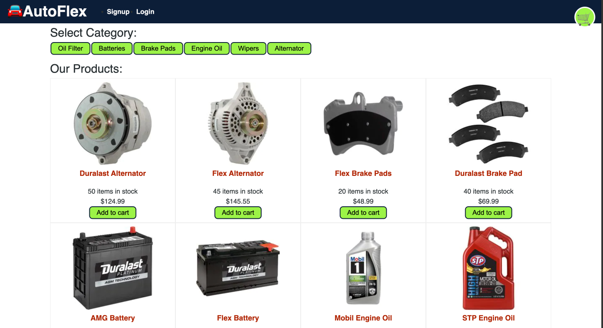
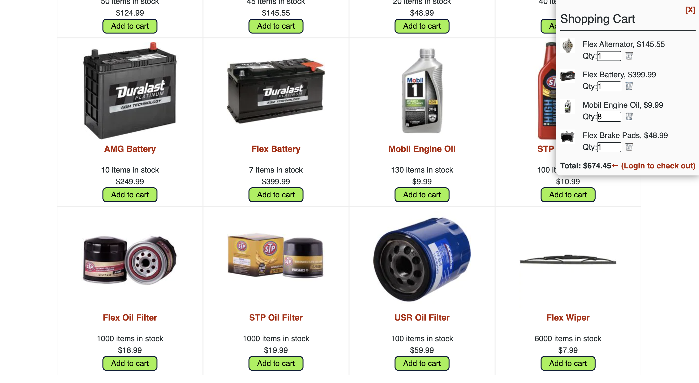

# AutoFlex

### This is a MERN(stack) application (Full Stack)
- AutoZFlex is a MERN stack application. This application implements the extensive use/knowlegde of the GraphQL API web services, with it's client-side rendered in ReactJS and server-side in NodeJS. The application allows users to select a particular product, and go as far purchasing the product via Stripe denpendencies. User's also gets the option to sign up and sign in which are handled in the backend and saved to the database. 

##### Application link: Attention! Please due to the Heroku free tier/dynos used during deployment. This application might take a few seconds to reload it's dynos from idle mode (Note: Personal applications do not have that much traffic to keep it's dynos consistently running)... <a href="https://autoflexecommservices.herokuapp.com/" target="_blank">www.autoflexecommservices.herokuapp.com</a>

#### Exposures
  - MongoDB, Express, ReactJS, NodeJS
  - GraphQL API
  - Redux
  - React Hooks
  - Stripe
  - Json Web Token

#### Displaying the application's home screen

#### Displaying the application's cart quantity with the total price

